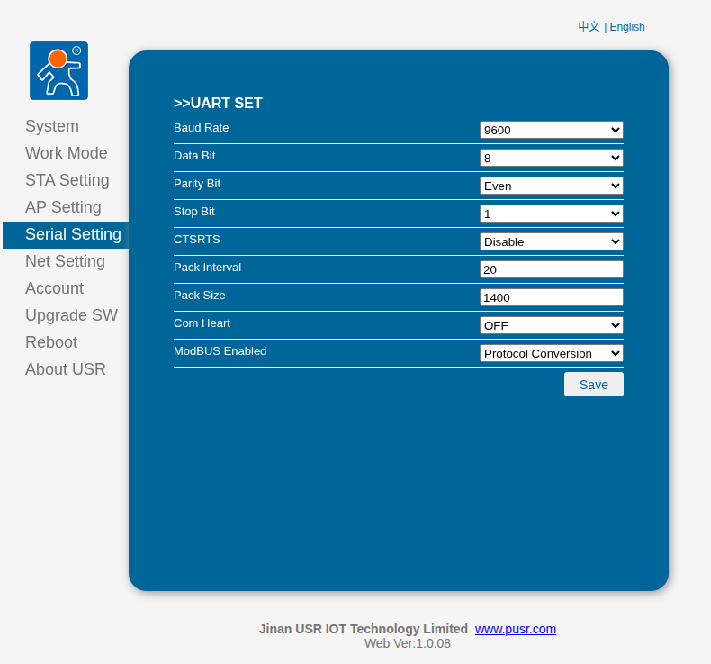
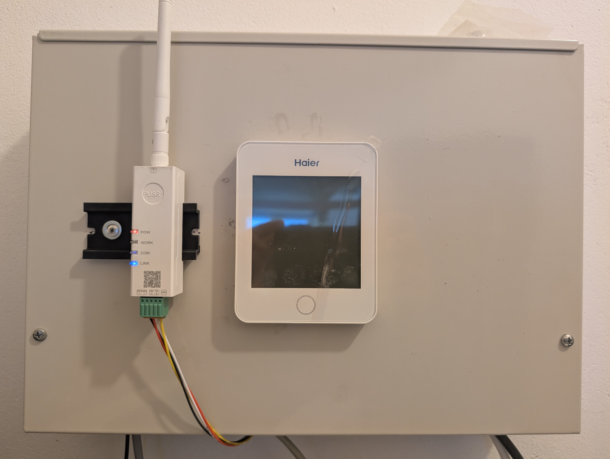

# Connection Instructions

To use this integration, you will need a **WiFi to RS485 converter**. This guide is based on the **USR-DR164** industrial modem.

---

### ⚙️ Serial Configuration
Configure your device using the serial settings shown below. Ensure these parameters match your RS485 bus requirements for stable communication.

---

### 🛠️ Hardware Setup
For a reliable and modular connection, it is recommended to use **JST-XH-TH-4-2.5** connectors. This allows you to easily swap between the **USR-DR164** and the **YR-E27 control panel** (e.g., for troubleshooting or in case of hardware failure).

#### Wiring Overview
The wiring is straightforward as the terminals are clearly labeled on the YR-E27 controller.

> [!TIP]
> **Modular Design:** Connect the cables directly from the JST connector to the RS485 terminals on the USR-DR164 to maintain a "plug-and-play" capability with the original hardware.

---
