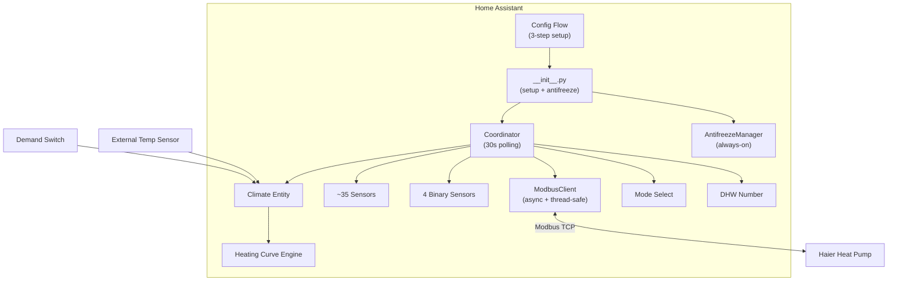

# Haier Heat Pump - Home Assistant Integration

Custom Home Assistant integration for **Haier heat pumps** using the [PyHaier](https://github.com/ktostam/PyHaier) library over Modbus TCP.

## Architecture

## Features

- **Full sensor suite**: ~35 sensors exposing all available heat pump data (temperatures, compressor, fans, pressures, errors, firmware, etc.)
- **Heating curve control**: Automatic CH water temperature based on outdoor temperature
  - **Formula mode**: `target = base_temp + slope × (setpoint - outdoor_temp) + offset`
  - **Point-based mode**: Define specific outdoor→water temperature pairs with linear interpolation
  - SVG curve preview in configuration UI
- **Demand-based operation**: Heat pump controlled by a switch entity
- **Antifreeze protection**: Always-on, configurable safety system
  - Warning threshold: turns on pump
  - Critical threshold: turns on pump + sets emergency CH temperature
  - Recovery threshold: restores original settings
- **Mode control**: eco / quiet / turbo
- **DHW temperature control**: Adjustable domestic hot water target
- **Safety first**: Rate limiting, read-before-write, write verification, temperature clamping

## Installation via HACS

1. Open HACS in Home Assistant
2. Click **⋮** → **Custom repositories**
3. Add this repository URL, category: **Integration**
4. Click **Download**
5. Restart Home Assistant
6. Go to **Settings → Devices & Services → Add Integration → Haier Heat Pump**

## Configuration

### Step 1: Connection
- **IP Address**: Modbus TCP gateway IP (default: `192.168.8.209`)
- **Port**: Modbus TCP port (default: `8899`)
- **Device ID**: Modbus slave ID (default: `17`)

### Step 2: Heating Curve
- **External Temperature Sensor**: Select a HA temperature sensor for outdoor readings
- **Demand Switch**: Select a switch/input_boolean that controls when the pump operates
- **Curve Type**: Formula-based or point-based
- Formula parameters: slope, base temperature, offset, indoor setpoint
- Point-based: comma-separated `outdoor:water` pairs

### Step 3: Antifreeze Protection
- **Warning threshold** (default: 5°C): Turn on pump
- **Critical threshold** (default: 2°C): Turn on + set emergency temp
- **Emergency CH temp** (default: 30°C): Temperature set during critical mode
- **Recovery threshold** (default: 20°C): Deactivate protection

## Entities

### Sensors
Temperature sensors (CH, DHW, water inlet/outlet, outdoor, compressor, etc.), compressor data (frequency, current, voltage), fan RPMs, EEV level, pressures, saturation temperatures, error codes, firmware version.

### Binary Sensors
- **Antifreeze Protection**: Active when software antifreeze is engaged
- **Alarm**: Active on error codes or critical temperature conditions
- **Defrost Active**: From pump's defrost cycle
- **HW Antifreeze**: From pump's built-in antifreeze flag

### Climate
Central heating control with heating curve integration.

### Select
Operating mode: eco / quiet / turbo.

### Number
DHW target temperature (30–55°C).

## Requirements

- Haier heat pump with Modbus TCP connectivity (tested with YR-e27 remote compatible models)
- PyHaier >= 0.4.4
- pymodbus >= 3.5.0

## Safety

- Temperature clamping: CH 25–55°C, DHW 30–55°C
- Read-before-write for all write operations
- Write verification (read-back check)
- Rate limiting: minimum 5 seconds between writes
- Antifreeze protection cannot be disabled
- Graceful degradation for unavailable register blocks

## License

MIT
